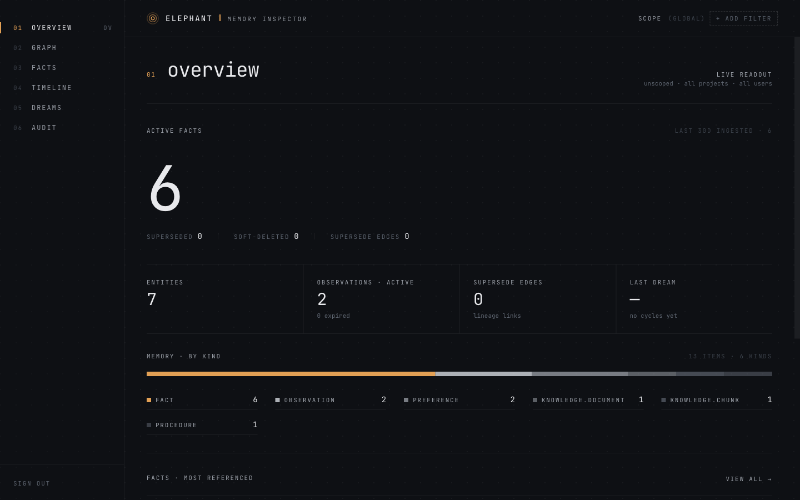
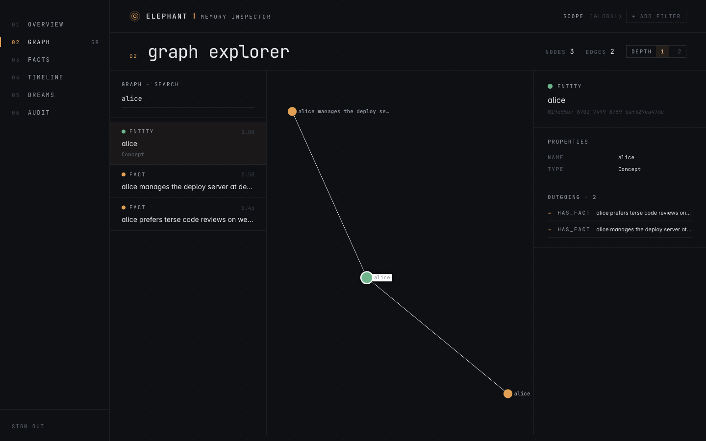
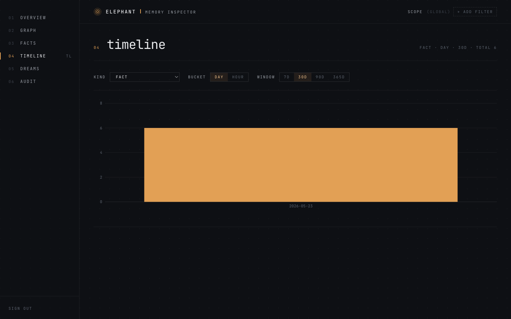
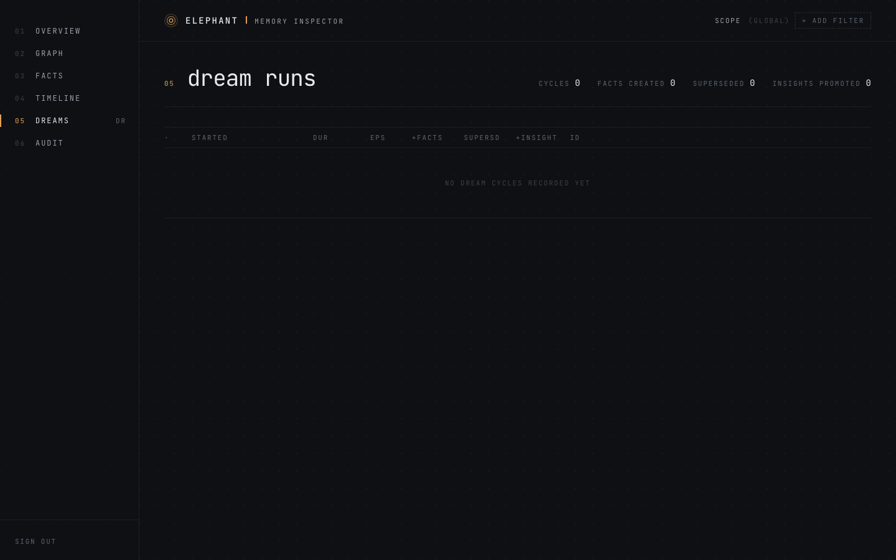
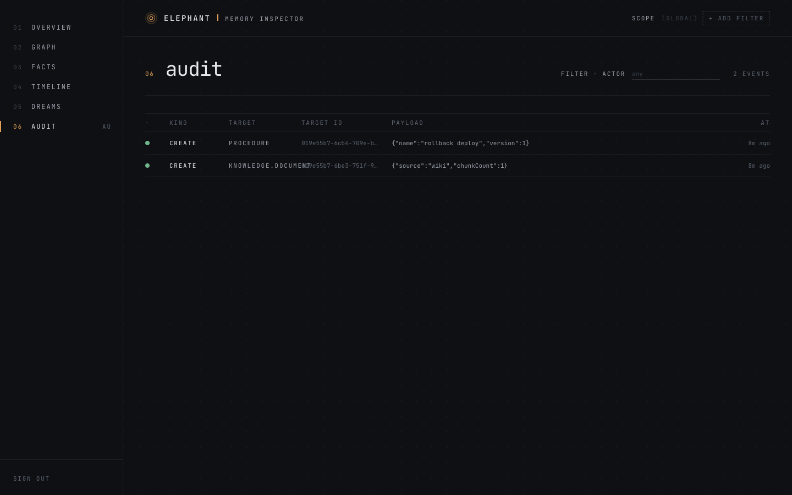

<p align="center">
  
</p>

# Elephant

**Long-term memory for AI agents, in a single service.** Elephant gives your
agent orchestrator durable, searchable memory backed entirely by Neo4j — its
native vector, full-text, and temporal capabilities mean there is no separate
vector database, SQL store, or queue to operate.

- **Hybrid GraphRAG recall** — vector + full-text search fused with reciprocal
  rank fusion, optional LLM reranking, and optional HippoRAG-style
  personalized PageRank over the entity graph.
- **Bi-temporal facts** — every fact tracks `validFrom`/`validTo` and
  `recordedAt`, and can be superseded without losing history.
- **Dreaming** — a scheduled consolidation job (default: nightly) extracts
  facts from raw episodes, deduplicates semantically, promotes high-importance
  facts to insights, builds entity relations, and prunes stale memories along
  an Ebbinghaus-style decay curve.
- **Scoped memory** — four scope axes (`agentId`, `sessionId`, `projectId`,
  `userId`), each configurable to *boost*, *filter*, or ignore at recall time.
- **Inspector dashboard** — a built-in web UI for browsing the graph, facts,
  timeline, dream runs, and audit log.

## How it works

Your orchestrator POSTs raw conversation **episodes**; Elephant chunks,
summarizes, and embeds them. Extraction (inline or during dreaming) turns
episodes into **facts** and **preferences**, which link to auto-upserted
**entities** — the hubs of the knowledge graph. Recall queries the whole
structure hybridly and returns a ranked, scoped working set. Everything is
auditable: fact creation, supersession, and deletion all record audit events
with revision snapshots.

v1.2 adds knowledge documents (file ingestion with blob storage),
versioned **procedures** (skills with success stats), project-scoped
**research** notes, a pluggable **working state** KV, and the audit API.

See [SPEC.md](SPEC.md) for the full data model and [EXPECTED.md](EXPECTED.md)
for the complete API contract. [INTEGRATION.md](INTEGRATION.md) walks through
wiring an orchestrator against the service.

## Quickstart

Requirements: Node ≥ 22, pnpm, Docker.

```bash
# 1. Start Neo4j (community image with APOC + GDS plugins)
docker compose up -d neo4j

# 2. Configure
cp .env.example .env
#    Set MEMORY_SERVICE_TOKEN, NEO4J_PASSWORD, and LLM/embedding keys
#    (ANTHROPIC_API_KEY and/or OPENAI_API_KEY; EMBED_DIM must match your
#    embedding model — see comments in .env.example).

# 3. Create the schema (idempotent)
pnpm install
pnpm migrate

# 4. Build the dashboard and serve
pnpm --filter @elephant/web build
pnpm serve
```

The service listens on `127.0.0.1:18790` by default; the dashboard is at
[`http://127.0.0.1:18790/dashboard/`](http://127.0.0.1:18790/dashboard/)
(sign in with your `MEMORY_SERVICE_TOKEN`).

`pnpm dev` runs the server in watch mode. `pnpm dream` triggers a dream cycle
manually. `scripts/backup-neo4j.py` / `restore-neo4j.py` provide online
logical backups.

## API at a glance

All endpoints are bearer-authenticated (`Authorization: Bearer <token>`) and
return an `{ok, data}` / `{ok, error}` envelope.

| Area | Endpoints |
|---|---|
| Episodes | `POST /episodes` |
| Facts | `POST /facts`, `POST /facts/batch`, `POST /facts/:id/supersede`, `DELETE /facts/:id` |
| Recall | `GET /recall` (hybrid search + scope boosts/filters) |
| Browse | `GET /timeline`, `GET /entities`, `GET /observations` |
| Preferences | `GET /preferences`, `PUT /preferences` |
| Dreaming | `POST /dream`, `GET /dream/:jobId` |
| Knowledge | `/knowledge/documents` (upload, chunk, embed files) |
| Procedures | `/procedures` (versioned skills with success stats) |
| Research | `/research` (project-scoped notes) |
| State | `/state` (working-state KV) |
| Audit | `GET /audit`, `GET /audit/:targetId` |
| Health | `GET /health` |

Full request/response shapes are in [EXPECTED.md](EXPECTED.md).

## Dashboard

<p align="center">
  
</p>

| | |
|---|---|
|  |  |
|  |  |

## Deployment

`deploy/` contains example systemd units (Neo4j container lifecycle + the
service itself) and an install script — see
[deploy/README.md](deploy/README.md).

## Security notes

- The service binds to `127.0.0.1` by default. If you change `MEMORY_BIND`,
  put it behind TLS and a reverse proxy — the bearer token is the only
  authentication layer.
- Memory content is sensitive by nature. The knowledge blob store
  (`KNOWLEDGE_BLOB_DIR`, default `./.knowledge-blobs`) holds raw uploaded
  documents on disk and is gitignored — keep it that way.

## Development

```bash
pnpm test               # unit tests
pnpm test:integration   # full HTTP surface against a throwaway Neo4j testcontainer (needs Docker)
pnpm lint               # biome
pnpm typecheck
```

## License

[MIT](LICENSE)
